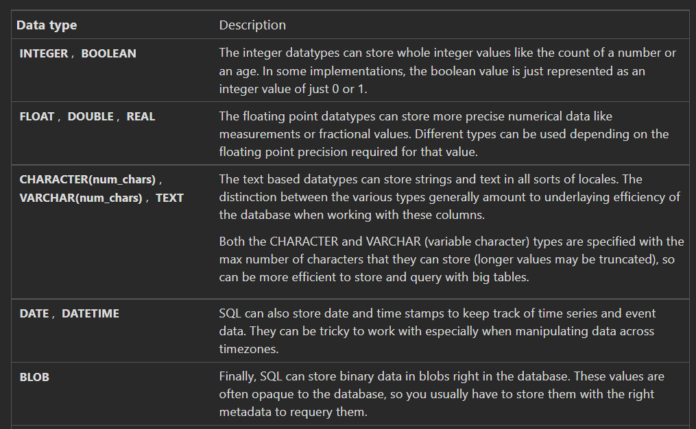

[Reference](https://sqlbolt.com/)

# SQL & Databases

## Database
It is a collection of data stored in a format that can be easily be accessed.

<br>

### Data can be stored in defferent ways:
  1. On paper.
  2. In your mind.
  3. On a PC 😍


## DBMS 
A special software program, helps users to CRUD and maintain DBs.

<br>

## DB types

## 1. Relational-DB (SQL)
- Rows & Columns (two-dimensional).
- Relationships b/t tables.
- simmilar to Excel Sheets.
- Unique key in each table.
- MySQL, Oracle, SQL Server.
    - Each DBMS has different flavor of SQL.

## 2. Non-Relational-DB (No SQL)
- Organize data in anything but not tables.
- Key-Value
- JSON, XML
- mongoDB, Firebase

<br>

## What is query?
A query is made to the DBMS for a specific information.
- A google search is a query.

<br>

# What is SQL?
A language used to interact with the DB. (CRUD)

<br>

## SQL Queries
To retrieve data from a SQL database, we need to write ***SELECT*** statements.

```sql
SELECT (DISTINCT) <attributes_list>
FROM <table_list>
WHERE <condition>
ORDER BY <one_attribute> ASC/DESC
LIMIT <num> OFFSET <start_num>;
```

>- DISTINCT used to retreve unique rows (non-repeating rows), and its optional.
>- LIMIT and OFFSET are commonly used with the ORDER BY, which are a useful optimization to indicate to he database the subset of the results you care about.
The LIMIT will reduce the number of rows to return, and the optional OFFSET will specify where to begin counting the number rows from.

<br>

## WHERE conditions
### Conditions #1


### Conditions #2


# TASKS


<br>
<br>

# Database Management (SQL)
# What is a Schema?
> Schema is describes the structure of each table, and the datatypes of each column.

<br>

## ***INSERT***.

```sql
INSERT INTO <table_name> all(leave_nothing), (col_1, col_2, ...)
VALUES <val_1, val_2, ...>, <val_1, val_2, ...>
```

- If a column has a default value, and you want that default value, use *default* keyword.

<br>

## ***UPDATE***.
```sql
UPDATE <table_name>
SET <col_1 = val, col_2 = val, ...>
WHERE <condition>
```
- If you leave the *WHERE* all records will be updated.

<br>

## ***DELETE***.

```sql
DELETE FROM <table_name>
WHERE <condition>;
```
- If you leave the *WHERE* all records will be deleted.

>it's recommended that you run the constraint in a SELECT query first to ensure that you are removing the right rows. Without a proper backup or test database, it is downright easy to irrevocably remove data, so always read your DELETE statements twice and execute once.

<br>

## ***Creating Table***

```sql
CREATE TABLE IF NOT EXISTS mytable (
    column DataType TableConstraint DEFAULT default_value,
    another_column DataType TableConstraint DEFAULT default_value,
    …
);
```

## Data Types


## constraints


<br>


## ***ALTER***
> ALTER TABLE statement to add, remove, or modify columns and table ***constraints***.

Altering table to add new column(s)
```sql
ALTER TABLE mytable
ADD column DataType OptionalTableConstraint 
DEFAULT default_value;
```

Altering table to remove column(s)
```sql
ALTER TABLE mytable
DROP column_to_be_deleted;
```

Altering table name
```sql
ALTER TABLE mytable
RENAME TO new_table_name;
```

<br>

## ***DROP TABLES***
```sql
DROP TABLE IF EXISTS mytable;
```