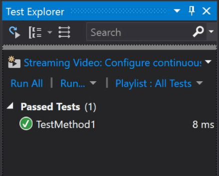

# Unit Testing

## Unit tests isolate and exercise specific units of your code.
you can think of a unit as a method.  You thus write a unit test by writing something that tests a method.

> Unit test methods useually thows defferent exceptions.


you might think that you could create a method for each test and call.
> This is old way.

Fortunately, you can do better. In Visual Studio:
1. Create a “Unit Test Project Template”
2. Imagine you are testing a Calculator, then the project will look like this

```c#
[TestClass]
public class UnitTest1
{
    [TestMethod]
    // for best practice -> name the method "public void Adding_4_And_3_Should_Return_7()"
    public void TestMethod1() 
    {
        var calculator = new Calculator();

        int result = calculator.Add(4, 3);

        Assert.AreEqual(7, result);
    }
}
```

3. Result will look like this



## Unit Testing Best Practices

### 1. Arrange, Act, Assert
- First, we *arrange* everything we need to run the experiment.  In this case, very little needs tohappen. In other, more complex cases, 
- With the arranging in place, we *act*. The *“act”* represents the star of the unit testing show.
- Finally, we *assert*.  The invocation of the *Assert* class probably gave that one away.  But the assert concept in the unit test represents a general category of action that you cannot omit and have a unit test.  It asserts the hypothesis itself.  Asserting something represents the essence of testing.

### 2. One Assert Per Test Method
- I won’t go so far as to say that no test should ever contain a number of assertions other thanone.  But I will say that your unit test suite should have a test to assert ratio pretty darned near1.
- If you assert 20 things, you still only see a single failure.  How will you know at a glance what went wrong — which of your 20 assertions failed?

### 3. Avoid Test Interdependence
- Each test should handle its own setup and tear down.  The test runner will execute your stuff in whatever order it pleases and, depending on the specific runner you use (advanced topic), it might even execute them in parallel.

### 4. Keep It Short, Sweet, and Visible
- The reasoning here is simple.  When a test fails, you want to understand what went wrong.  You thus want a test where all setup logic reveals itself to you at a glance.

### 5. Add Them to the Build
- If your team has a continuous integration build, add your new unit test suite’s execution to the build.  If any tests fail, then the build fails.  No exceptions, no ifs, ands or buts.

## Notes:

> If you write code that stuffs things into a database or that reads a file from disk, you have not written a unit test.  Unit tests don’t deal with their environment and with external systems to the codebase.

> If it you’ve written something that can fail when run on a machine without the “proper setup,” you haven’t written a unit test.

> unit tests don’t exercise multiple components of your system and how they act.  If you have a console application and you pipe input to it from the command line and test for output, you’re executing an end-to-end system test — not a unit test.